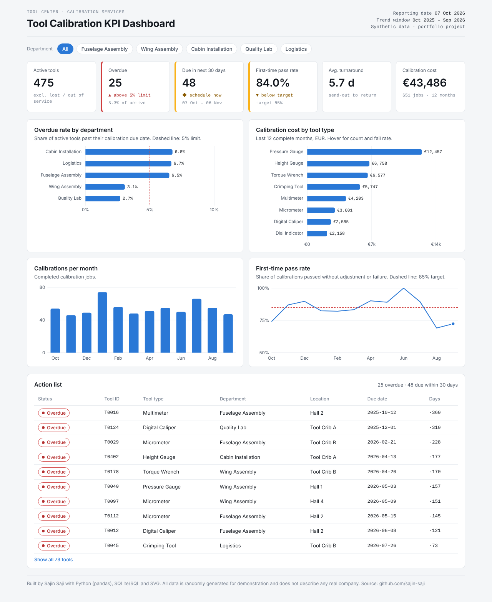

# Tool Calibration KPI Dashboard

I built this project to practice the full way from messy raw data to a dashboard that someone in a tool center could actually use. The question behind it is simple: which tools are overdue for calibration, which ones are due soon, and where is the problem worst?

Live dashboard: https://sajin-saji.github.io/tool-calibration-kpi-dashboard/dashboard/
Project report (PDF): [docs/Project_Report.pdf](docs/Project_Report.pdf)

Note: the data is generated by my own script (`src/generate_data.py`). It is not real company data. I added typical errors on purpose (duplicates, typos, wrong date formats, negative costs) so that the cleaning step is realistic.



## What I did

1. Generated a dataset of 500 tools and about 1,300 calibration records with Python.
2. Cleaned it with pandas: removed duplicates, fixed department names, converted dates from DD.MM.YYYY, recalculated missing due dates and removed records with invalid costs. Every fix is written to `data/cleaning_report.txt`.
3. Loaded the clean data into a SQLite database.
4. Wrote the KPIs as SQL queries (`sql/kpi_queries.sql`).
5. Built a small web dashboard from the database, with a department filter and an action list.

## Results (data as of 07.10.2026)

- 475 active tools, 25 of them overdue (5.3%). That is just above a 5% limit.
- Most overdue tools are in Cabin Installation (6.8%), Logistics (6.7%) and Fuselage Assembly (6.5%).
- 48 tools are due in the next 30 days. These should be planned now.
- First-time pass rate over the last 12 months is 84.0% (target 85%). It dropped to around 70% in August and September 2026.
- Pressure gauges cost the most to calibrate (12,457 €). Multimeters fail most often (11.3%).

## What I learned

- Most of the time went into cleaning, not into the charts. Small things like two date formats in one column break every later calculation.
- Writing the KPI definitions first (what exactly counts as "overdue" or "active") made the SQL and the dashboard much easier.
- I checked every number in the dashboard against the SQL output so they always match.

## Next steps

- Rebuild the same dashboard in Power BI (my notes are in `docs/power_bi_guide.md`).
- Add a forecast of how many calibrations are due per month.

## How to run it

```bash
pip install pandas
python src/generate_data.py
python src/clean_data.py
sqlite3 data/calibration.db < sql/kpi_queries.sql
python src/build_dashboard.py
```

Then open `dashboard/index.html` in a browser.

## Folder structure

```
data/        raw and cleaned CSV files, SQLite database, cleaning report
sql/         KPI queries
src/         Python scripts (generate, clean, build dashboard)
dashboard/   the dashboard (index.html)
docs/        project report, screenshot, Power BI notes
```

Sajin Saji, M.Eng Mechatronics & Cyber-Physical Systems, TH Deggendorf
[Portfolio](https://sajin-saji.github.io) · [LinkedIn](https://linkedin.com/in/sajin-saji-4762561b5)
